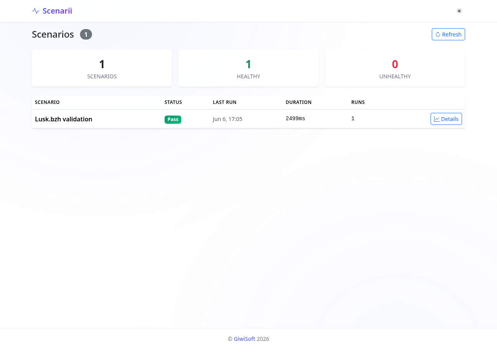
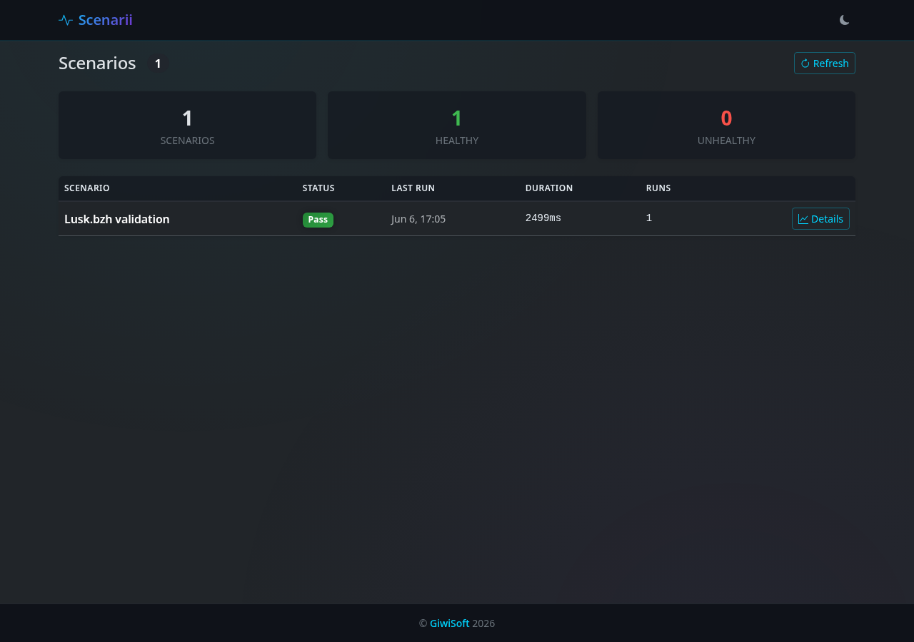
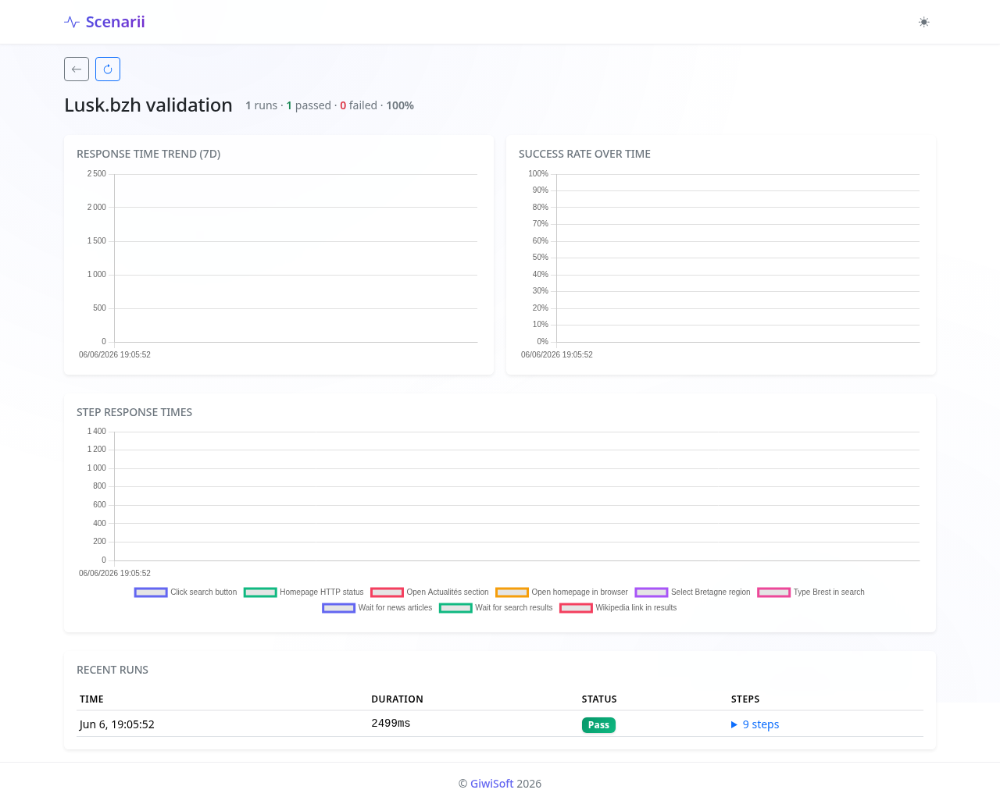
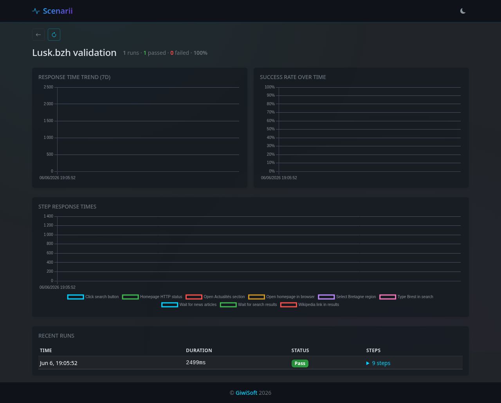

<p align="center">
  
</p>

<p align="center">
  Execute periodic YAML-defined web test scenarios via a headless browser (or native HTTP), store metrics in SQLite, and monitor them on a modern Dashboard with dark/light themes.
</p>

## Quick start

```bash
npm install
npm run build

# Start the server (schedules scenarios + serves dashboard)
node dist/index.js server

# Or run a scenario once
node dist/index.js --once scenarios/lusk.yml
```

Open http://localhost:3000 to see the dashboard. Each scenario also has a shareable public status page at `/public/status/:name` (no auth required).

## Requirements

- Node.js >= 26 (for Angular 22 and native fetch)
- For browser scenarios: `@lightpanda/browser` (optional - HTTP-only scenarios use native fetch)

## CLI

| Command | Description |
|---------|-------------|
| `server` | Start API server + Dashboard |
| `validate <file>` | Validate a scenario YAML without running it |
| `trigger <file>` | Run a scenario immediately |
| `status` | Show scheduled scenarios and storage status |
| `config --init` | Generate a `settings.yaml` template |

```bash
node dist/index.js validate scenarios/lusk.yml
node dist/index.js trigger scenarios/lusk.yml
node dist/index.js status
node dist/index.js config --init
```

### Server options

| Option | Default | Description |
|--------|---------|-------------|
| `-p, --port` | `3000` | HTTP port |
| `--db` | `db/scenarii.db` | SQLite database path |
| `--scenarios-dir` | `./scenarios` | Directory with `.yml`/`.yaml` scenario files (watched every 5s - add/remove/rename files without restart) |
| `--settings` | auto-detect | Path to settings file (hot-reloaded, see Notifications below) |

## Writing scenarios

Scenarios are YAML files. HTTP-only steps run in parallel using native fetch; browser steps are serialised (Lightpanda CDP supports one connection at a time). Steps can optionally declare a `timeout` (ms) and a `condition` for conditional execution based on previous step results.

```yaml
name: Example
base_url: https://example.com
schedule: "*/5 * * * *"   # optional cron expression
timeout: 120000           # per-scenario timeout override (default 120s)
ignoreHTTPSErrors: false  # per-scenario SSL override
tags: [critical, auth]    # optional tags for dashboard filtering
depends_on: "Health check" # optional - skip this scenario if dependency last run failed
alert:                    # optional alert rules
  consecutive_failures: 3 # warn after N consecutive failures

steps:
  - name: Homepage
    action: http.get
    url: /
    expect:
      status: 200

  - name: Open page
    action: browser.navigate
    url: /

  - name: Click button
    action: browser.click
    selector: "#submit"

  - name: Check result
    action: browser.wait_for
    selector: ".result"
    timeout: 5000

  - name: Login API
    action: http.post
    url: /api/login
    timeout: 10000            # per-step timeout override
    expect:
      status: 200

  - name: Dashboard check
    action: http.get
    url: /api/dashboard
    condition:                # skip if Login API failed
      if_step: "Login API"
      if_success: true
    expect:
      status: 200
```

### HTTP actions

HTTP-only scenarios use the native `fetch` API - no Playwright or browser needed for simple API monitoring.

| Action | Fields |
|--------|--------|
| `http.get` / `http.post` / `http.put` / `http.patch` / `http.delete` | `url`, `headers`, `body`, `expect` |

**Expectations**: `status`, `status_in`, `body_contains`, `body_matches`, `header_contains` (format `"HeaderName: value"`), `header_matches` (format `"HeaderName: regex"`), `json_path`, `json_value`, `response_time_under`

### Browser actions

| Action | Fields |
|--------|--------|
| `browser.navigate` | `url` |
| `browser.fill` | `selector`, `value` |
| `browser.type` | `selector`, `value` |
| `browser.click` | `selector` |
| `browser.wait_for` | `selector`, `timeout`, `expect` (has_text, not_has_text, url_contains) |
| `browser.select` | `selector`, `value` |
| `browser.evaluate` | `script` (JavaScript to run in the page) |
| `browser.check` / `browser.uncheck` | `selector` |
| `browser.screenshot` | `value` (output path) |
| `browser.screenshot_compare` | `value` (baseline path - creates baseline on first run, compares on subsequent) |
| `browser.scroll` | `value` (pixels to scroll down), `selector` (scroll element into view) |

Browser steps automatically retry up to 2 times with exponential backoff (1s, 2s) on failure.

### Variables

Steps can reference values from previous steps using `{{variable_name}}`. Variables are extracted from HTTP responses using the `variables` field with a `json_path` selector.

## Dashboard

The dashboard provides:

- **Scenario list** - overview of all scenarios with pass/fail status, tag badges, tag filter dropdown, depends-on column, auto-refreshes via WebSocket
- **Scenario detail** - response time trend chart, success rate over time, step breakdown, SLA gauge (7-day window), paginated run history, JSON/CSV/YAML export, live ticker (inline step progress in the toolbar), copy public permalink
- **Run Now / Cancel** - trigger an immediate ad-hoc run or abort a running scenario from list or detail
- **Pause/Resume** - toggle scheduled scenarios on/off without deleting files
- **Dark/light theme** - toggle in the navbar, preference saved to localStorage
- **Dashboard auth** - optional OIDC-based login (configured in `settings.yaml`); all API routes except `/api/health` and `/api/auth/*` require a session cookie
- **Manual refresh** - refresh button on both list and detail pages
- **Public status** - per-scenario pages at `/public/status/:name` with stat cards and response time / success rate charts; no auth required
- **Public API** - `GET /api/status` (summary) and `GET /api/public/scenario/:name` (per-scenario detail) - both accessible without auth

<p align="center">
  
  
  <br>
  
  
</p>

## Running

```bash
# Development (both API + Angular HMR with one command)
npm run dev

# Or run them separately:
npm run dev:server     # Express API + scenario scheduling on :3000
npm run dev:frontend   # Angular dev server on :4200 with HMR
npm run dev:once       # Run the lusk scenario once

# Production
npm run build
node dist/index.js server
```

## API endpoints

| Endpoint | Description |
|----------|-------------|
| `GET /api/scenarios` | List all scenarios with last run status (`?tag=critical`) |
| `GET /api/scenarios/:name` | Scenario detail with paginated run history (`?limit=&offset=&days=`) |
| `GET /api/scenarios/:name/history` | Raw run history (`?limit=&offset=&days=`) |
| `POST /api/scenarios/:name/run` | Trigger an immediate ad-hoc run |
| `POST /api/scenarios/:name/cancel` | Abort a running scenario |
| `POST /api/scenarios/:name/pause` | Pause a scheduled scenario |
| `POST /api/scenarios/:name/resume` | Resume a paused scenario |
| `GET /api/scenarios/:name/config` | Download scenario YAML configuration |
| `PUT /api/scenarios/:name/config` | Save/update scenario YAML (`{"yaml":"..."}`) |
| `DELETE /api/scenarios/:name/config` | Delete a scenario file |
| `GET /api/scenarios/:name/export/json` | Download all history as JSON |
| `GET /api/scenarios/:name/export/csv` | Download all history as CSV |
| `GET /api/scenarios/:name/sla` | SLA calculation (`?days=7`) - returns `{ sla, total_runs, passed_runs, failed_runs }` |
| `GET /api/auth/login` | Redirect to OIDC provider (requires `auth.oidc` in settings) |
| `GET /api/auth/callback` | OIDC callback - exchanges code for session cookie |
| `GET /api/auth/me` | Return `{ authenticated: boolean }` |
| `POST /api/auth/logout` | Clear session cookie |
| `POST /api/backup` | Trigger a manual database backup |
| `GET /api/tags` | List all distinct tags |
| `GET /api/public/scenario/:name` | Public per-scenario JSON detail (no auth required) |
| `GET /api/status` | Public status summary (healthy/unhealthy counts, no auth) |
| `GET /api/health` | Health check (200 = ready, 503 = initializing) |
| `GET /api/metrics` | Prometheus/OpenMetrics format (see below) |

Responses include an `X-Request-Id` header for tracing.

Prometheus can scrape `http://localhost:3000/api/metrics` for:

- `scenarii_scenario_runs_total{scenario}` - total run count
- `scenarii_scenario_duration_ms{scenario}` - latest run duration (ms)
- `scenarii_scenario_success{scenario}` - latest run 1=pass / 0=fail
- `scenarii_scenario_last_run_seconds{scenario}` - last run timestamp
- `scenarii_step_duration_ms{scenario,step,action}` - per-step duration
- `scenarii_step_success{scenario,step,action}` - per-step success
- `scenarii_notification_delivery_total{status}` - notification delivery success/failure count

## Real-time updates

The server exposes a WebSocket endpoint at `/ws`. After each scenario run, a JSON message is broadcast to all connected clients:

```json
{
  "type": "scenario_run",
  "scenario_name": "Lusk.bzh validation",
  "success": true,
  "duration_ms": 2500,
  "timestamp": "2026-06-06T12:00:00.000Z"
}
```

During a run, **step progress** messages are streamed in real-time:

```json
{
  "type": "step_progress",
  "scenario_name": "Example",
  "step_name": "Homepage",
  "action": "http.get",
  "status": "running",
  "timestamp": "2026-06-06T12:00:00.000Z"
}
```

The dashboard shows a live ticker in the detail toolbar while steps are executing, displaying the current step name, response time, and status icon.

## Notifications

Get alerted when a scenario fails and when it recovers. Create a `settings.yaml` file:

```yaml
api:
  auth:
    enabled: true
    api_key: "YOUR_API_KEY"      # protects /api/metrics

auth:
  enabled: true                  # optional dashboard authentication
  oidc:                          # OIDC provider configuration
    issuer_url: "https://accounts.google.com"
    client_id: "YOUR_CLIENT_ID"
    client_secret: "YOUR_CLIENT_SECRET"
    redirect_uri: "http://localhost:3000/api/auth/callback"
    scopes: "openid profile email"

storage:
  retentionDays: 30              # data retention period (default 7)
  backup:                        # optional automated backups
    enabled: true
    cron: "0 4 * * *"           # default: daily at 4am
    directory: "./backups"      # default: ./backups

notifications:
  telegram:
    enabled: true
    bot_token: "YOUR_BOT_TOKEN"
    chat_id: "YOUR_CHAT_ID"
  email:
    enabled: true
    mailgun:
      api_key: "YOUR_API_KEY"
      domain: "YOUR_DOMAIN"
      from: "scenarii <notifications@YOUR_DOMAIN>"
    to:
      - "admin@example.com"
  slack:
    enabled: true
    webhook_url: "https://hooks.slack.com/services/..."
  discord:
    enabled: true
    webhook_url: "https://discord.com/api/webhooks/..."
  webhook:
    enabled: true
    url: "https://your-endpoint/hook"
```

Secrets can be overridden via environment variables: `TELEGRAM_BOT_TOKEN`, `TELEGRAM_CHAT_ID`, `MAILGUN_API_KEY`, `MAILGUN_DOMAIN`.

The server looks for `settings.yaml` in the current directory or `/app/settings.yaml` (container). Use `--settings` to specify a custom path. Notifications trigger on state transitions (pass>fail, fail>pass). Notifications include retry logic (3 attempts, exponential backoff).

A **daily email report** is automatically sent at 8:00 AM (cron) if email notifications are configured.

### Per-scenario overrides

You can override settings per scenario in `settings.yaml`:

```yaml
scenarios:
  my-scenario:
    ignoreHTTPSErrors: true
    timeout: 60000
    notifications:
      enabled: false
```

### Hot-reload

`settings.yaml` is watched for changes and reloaded automatically - no server restart needed.

## Container

### Pre-built image (recommended)

Published on each push to `main`:

```bash
docker pull ghcr.io/giwi/giwisoft-scenarii:latest

mkdir -p scenarios db
cp settings.example.yaml settings.yml  # optional, for notifications
docker run -d \
  --name scenarii \
  -p 3000:3000 \
  -v $(pwd)/scenarios:/scenarios \
  -v $(pwd)/db:/app/db \
  -v $(pwd)/settings.yml:/app/settings.yml:ro \
  ghcr.io/giwi/giwisoft-scenarii:latest
```

### Build locally

```bash
./build-container.sh
# or
npm run package

docker run -d \
  --name scenarii \
  -p 3000:3000 \
  -v $(pwd)/scenarios:/scenarios \
  -v $(pwd)/db:/app/db \
  -v $(pwd)/settings.yml:/app/settings.yml:ro \
  giwisoft-scenarii:latest
```

The container uses `dumb-init` for proper signal handling, runs as non-root (`USER node`), and includes a `HEALTHCHECK` pinging `/api/health` every 30s. Built on `node:26-slim` (glibc) for full Lightpanda compatibility.

> **Rootless podman** - if using rootless podman, mount volumes may be owned by the host user but inaccessible to the container's `node` user. Add `--userns=keep-id` to map the container user to your host UID:
> ```bash
> podman run -d \
>   --name scenarii \
>   --userns=keep-id \
>   -p 3000:3000 \
>   -v $(pwd)/scenarios:/scenarios \
>   -v $(pwd)/db:/app/db \
>   -v $(pwd)/settings.yml:/app/settings.yml:ro \
>   ghcr.io/giwi/giwisoft-scenarii:latest
> ```

### Multi-arch (linux/amd64 + linux/arm64)

Pre-built images support both `amd64` and `arm64`. To build for a specific architecture:

```bash
PLATFORM=linux/arm64 ./build-container.sh
```

To build a multi-arch manifest (requires `docker buildx`):

```bash
PLATFORM=multi ./build-container.sh
```

Or using `make`:

```bash
make build        # linux/amd64 (default)
make build-arm64  # linux/arm64
make build-multi  # multi-arch manifest
```

## CI/CD

On push to `main`, GitHub Actions:

1. Installs dependencies and runs `tsc --noEmit`
2. Executes unit tests (`npm test`)
3. Builds the frontend and backend
4. Builds the Docker image (`linux/amd64`, `linux/arm64`) with a smoke test and vulnerability scan
5. Publishes the multi-arch Docker image to **GitHub Container Registry** (tagged `latest` + git SHA)

The workflow is in `.github/workflows/ci.yml`. Dependabot is configured for weekly npm and GitHub Actions updates.

## Testing

```bash
npm test
```

Uses Node's built-in test runner (`node:test`) - no extra dependencies. Tests cover the sequential execution queue, notification state machine, settings schema validation, URL resolution, variable interpolation, JSON path extraction, YAML parse/serialize, HTTP expectations, and retry logic. Test files live in `tests/` and are compiled via `tests/tsconfig.json` to `dist-test/`.

## Tech stack

- **Runtime** - Node.js 26 + TypeScript (strict mode)
- **CLI** - Commander
- **HTTP** - Native `fetch` (no Playwright needed for API monitoring)
- **Browser** - Lightpanda headless browser via Playwright CDP (with retry)
- **Database** - SQLite (better-sqlite3, WAL mode)
- **Scheduling** - node-cron
- **Notifications** - Telegram, Slack, Discord, Generic Webhook, Mailgun (all with retry)
- **Logging** - pino (structured JSON, ISO timestamps)
- **Security** - Helmet (CSP, HSTS, X-Frame-Options, etc.), optional OIDC-based dashboard auth with HTTP-only session cookies
- **Frontend** - Angular 22 (standalone components), Bootstrap 5, Chart.js, Bootstrap Icons
- **Container** - Debian-slim (`node:26-slim`), multi-stage build, non-root user
